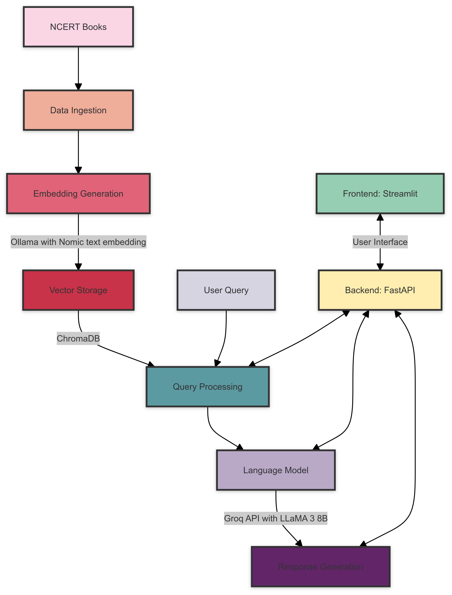

# 📚 NCERT Books RAG System

This project implements a **Retrieval-Augmented Generation (RAG)** system tailored for NCERT textbooks. It combines **Ollama** for generating embeddings, **ChromaDB** as the vector store, and **Groq API with LLaMA 3 8B** for generating intelligent responses — all wrapped with a **FastAPI** backend and a **Streamlit** frontend.

---

## 🚀 Features

* 🔍 **Text Embedding**: Uses **Nomic embed model** via Ollama to generate high-quality vector representations of NCERT content.
* 🧠 **LLM Integration**: Leverages **Groq API** with **LLaMA 3 8B** for contextual and accurate answer generation.
* 📦 **Vector Storage**: Efficient retrieval of embeddings using **ChromaDB**.
* ⚡ **Backend**: Built on **FastAPI** for robust API endpoints.
* 🎛️ **Frontend**: Interactive UI built with **Streamlit** for querying and viewing results.

---

## 🖥️ Streamlit Interface

Here’s a preview of the user interface built using Streamlit:


---

## 🧩 System Architecture

The system is composed of modular components working together to deliver contextual responses from NCERT materials:



**Components Overview**:

1. **📘 Data Ingestion**: Parse and preprocess NCERT book content.
2. **🔢 Embedding Generation**: Generate vector embeddings via Ollama’s `nomic-embed-text`.
3. **🗃️ Vector Storage**: Store embeddings in ChromaDB for quick and relevant lookups.
4. **🧾 Query Processing**: Accept and transform user queries for semantic search.
5. **🤖 Language Generation**: Use Groq’s LLaMA 3 8B to generate final responses.
6. **🧪 Backend**: Orchestrate operations using FastAPI.
7. **🧑‍💻 Frontend**: Provide a clean interface through Streamlit.

---

## ⚙️ Prerequisites

Make sure you have the following installed:

* Python 3.7+
* [Ollama](https://ollama.ai) installed locally
* Groq API access and API key

---

## 📦 Installation

1. **Clone the repository**:

   ```bash
   git clone https://github.com/yourusername/ncert-rag-system.git
   cd ncert-rag-system
   ```

2. **Install dependencies**:

   ```bash
   pip install -r requirements.txt
   ```

3. **Install and configure Ollama**:

   * Visit [Ollama's site](https://ollama.ai) for installation instructions
   * Download the embedding model:

     ```bash
     ollama pull nomic-embed-text
     ```

4. **Configure your Groq API Key**:

   * Create a `.env` file in the root:

     ```
     GROQ_API_KEY=your_api_key_here
     ```

---

## ▶️ Usage

1. **Start the backend (FastAPI)**:

   ```bash
   uvicorn main:app --reload
   ```

2. **Run the frontend (Streamlit)**:

   ```bash
   streamlit run streamlit_app.py
   ```

3. **Access the app**:

   * Open your browser and go to: `http://localhost:8501`

4. **Ask questions!**

   * Query the system and get accurate, contextual answers from NCERT books.

---

## 📊 RAG Evaluation

Below are some performance metrics and qualitative evaluation results for the RAG system:


---

## 📝 License

This project is licensed under the **MIT License**. See the [LICENSE](LICENSE) file for more details.

---

## 🤝 Contributing

We welcome contributions! If you find bugs, have suggestions, or want to extend functionality, please open an issue or submit a Pull Request.

---

## 🙏 Acknowledgements

* [**Ollama**](https://ollama.ai) – for text embedding capabilities
* [**Groq**](https://groq.com) – for fast and efficient LLM inference
* [**FastAPI**](https://fastapi.tiangolo.com) – for a powerful backend
* [**Streamlit**](https://streamlit.io) – for quick and elegant frontend UIs

---